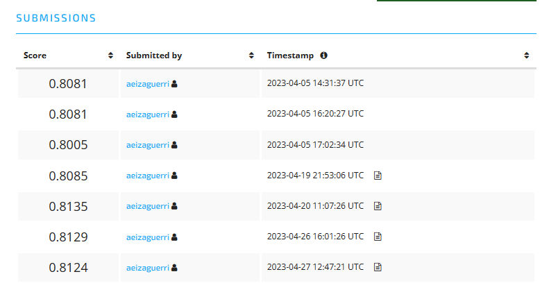

# Pump-It-Up_Data-Driven_Challenge

Modelado para la competición Pump It Up de Data Driven.

En el notebook llamado EDA (Exploratory Data Analysis) se ha realizado una exploración de los datos utilizando la librería pandas profilling para obtener un reporte de las variables y posteriormente se ha llevado a cabo una limpieza de variables inncesarias y/o repetitivas y la posterior limpieza de las variable seleccionadas para el modelado. Una vez comprobado que el dataset queda limpio, se ha creado una función para realizar todo el proceso de limpieza en los datasets para el modelado.

En el notebook Modelling, se ha realizado un screening de distintos algoritmos de ML y una vez seleccionado el mejor, se ajustaron sus hiperparámetros por medio de dos métodos distintos. 

Como resultado, se realizaron seis submits a la competición en los que se obtuvieron los siguientes resultados:

Siendo el mejor de ellos el obtenido utilizando el modelo de Random Forest con ajuste aleatorio de los hiperparámetros (0.8135), que comparado con el mejor valor a nivel global (0.8290), se comporta bastante bien, teniendo en cuenta que es un modelo relativamente sencillo y que no se ha llevado a cabo un trabajo demasiado exhaustivo en el ajuste de los modelados y que no se ha creado ninguna nueva variable en el dataset, por lo que el modelo aún tendría margen de mejora.

